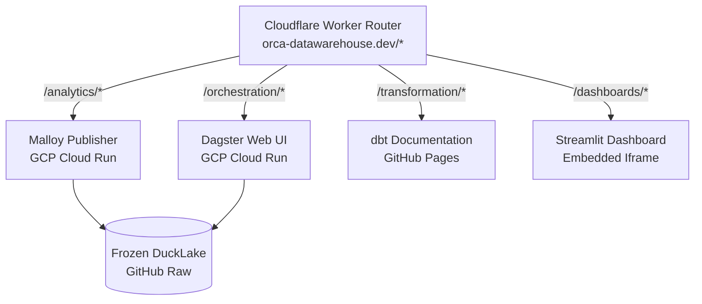

# Deployment Guide

Serverless hosted deployment guide for `orca-datawarehouse.dev`.

## 1. Architecture



## 2. Routes & Services

| Route | Service | Backend | Access |
| --- | --- | --- | --- |
| `/analytics/` | Malloy Publisher | GCP Cloud Run (`orca-malloy`) | Interactive dashboards |
| `/orchestration/` | Dagster Web UI | GCP Cloud Run (`orca-dagster`) | Read-only asset graph & logs |
| `/transformation/` | dbt Docs | GitHub Pages | Static lineage & docs |
| `/dashboards/` | Streamlit | Streamlit Cloud | Embedded iframe |

## 3. Cost Safeguards & Scaling

* **Scale-to-Zero & Limits**: `--min-instances 0` (zero cost idle) / `--max-instances 1` (prevents runaway billing).
* **Performance**: `--concurrency 80` (80 req/instance) / `--cpu-boost` (fast cold starts).
* **Billing Optimization**: `--cpu-throttling` (CPU billed strictly during active HTTP processing).

## 4. Setup Steps

### Step 1: GCP Setup & GitHub Auth

```bash
# Project & APIs
gcloud projects create orca-datawarehouse --name="Orca Data Warehouse"
gcloud config set project orca-datawarehouse
gcloud services enable run.googleapis.com artifactregistry.googleapis.com

# Service Account & Roles
gcloud iam service-accounts create github-actions-deployer
SA="github-actions-deployer@orca-datawarehouse.iam.gserviceaccount.com"

for role in run.admin artifactregistry.admin iam.serviceAccountUser; do
  gcloud projects add-iam-policy-binding orca-datawarehouse --member="serviceAccount:$SA" --role="roles/$role"
done

# Key generation -> Add raw JSON to GitHub Secret `GCP_SA_KEY`
gcloud iam service-accounts keys create key.json --iam-account=$SA
```

*Deployments trigger automatically via GitHub Actions on changes to `deployment/`, `orchestration/`, or `analytics/`.*

### Step 2: Cloudflare Router & WAF

1. **DNS**: Add proxied `AAAA` record pointing `@` to `100::` on `orca-datawarehouse.dev` and `CNAME` record for `www`.
2. **Deploy Worker**: `cd deployment && npx wrangler deploy`
3. **Domain Mapping**: Attach custom domain `orca-datawarehouse.dev` to `orca-router`.
4. **WAF Safeguard**: Add rate limit rule to block traffic > 10 requests/10 seconds.

## 5. Local Development & Ops

```bash
# Local testing
uv run dagster-webserver -h 0.0.0.0 -p 8080 -f orchestration/definitions.py --path-prefix /orchestration --read-only
npx @malloy-publisher/server --config analytics/malloy-config.json --port 8080 --host 0.0.0.0

# Monitoring
gcloud logging read "resource.type=cloud_run_revision AND resource.labels.service_name=orca-dagster" --limit 50
cd deployment && npx wrangler tail
```
