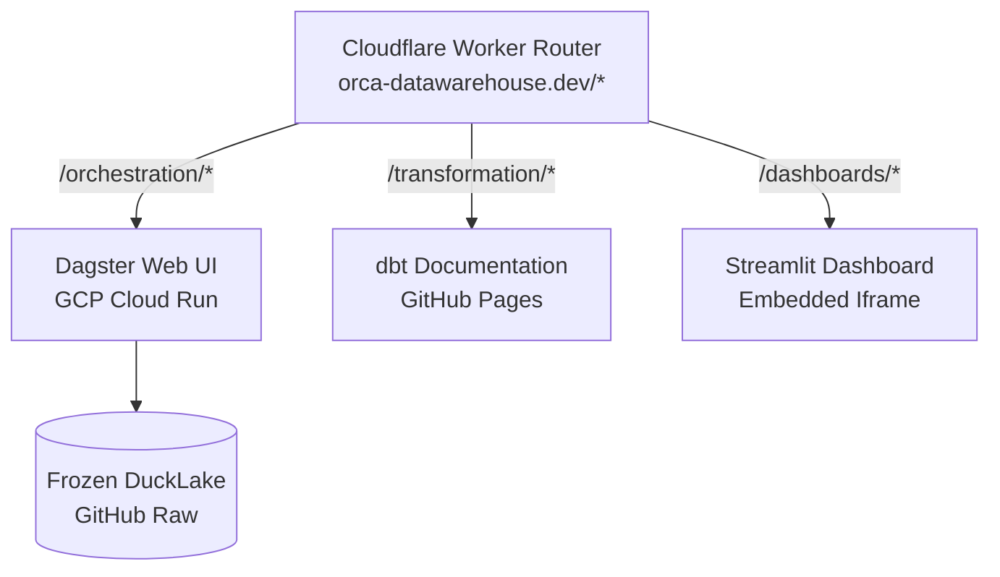

# Deployment Guide

Serverless hosted deployment guide for `orca-datawarehouse.dev`.

## 1. Architecture



## 2. Routes & Services

| Route | Service | Backend | Access |
| --- | --- | --- | --- |
| `/orchestration/` | Dagster Web UI | GCP Cloud Run (`orca-dagster`) | Read-only asset graph & logs |
| `/transformation/` | dbt Docs | GitHub Pages | Static lineage & docs |
| `/dashboards/` | Streamlit | Streamlit Cloud | Embedded iframe |

## 3. Cost Safeguards & Scaling

* **Scale-to-Zero & Limits**: `--min-instances 0` (zero cost idle) / `--max-instances 1` (prevents runaway billing).
* **Performance**: `--concurrency 80` (80 req/instance) / `--cpu-boost` (fast cold starts).
* **Billing Optimization**: `--cpu-throttling` (CPU billed strictly during active HTTP processing).
* **Artifact Storage Cap (< 500MB Free Tier)**: CI/CD tags images strictly with `:latest` (in-place tag overwrite). This prevents multiple commit SHA image manifests from accumulating in Artifact Registry between asynchronous 24-hour cleanup policy executions.

## 4. Setup Steps

### Step 1: GCP Setup & GitHub Auth (OIDC Workload Identity)

1. **Create Project & Enable Services**:
   ```bash
   gcloud projects create orca-datawarehouse --name="Orca Data Warehouse"
   gcloud config set project orca-datawarehouse
   gcloud services enable run.googleapis.com artifactregistry.googleapis.com iamcredentials.googleapis.com sts.googleapis.com
   ```

2. **Create Deployer Service Account (for GitHub Actions)**:
   ```bash
   gcloud iam service-accounts create github-actions-deployer
   SA_DEPLOYER="github-actions-deployer@orca-datawarehouse.iam.gserviceaccount.com"

   for role in run.admin artifactregistry.admin iam.serviceAccountUser; do
     gcloud projects add-iam-policy-binding orca-datawarehouse \
       --member="serviceAccount:$SA_DEPLOYER" \
       --role="roles/$role"
   done
   ```

3. **Configure Workload Identity Federation (OIDC - Keyless Auth)**:
   Create an OIDC Workload Identity Pool and Provider to allow GitHub Actions to authenticate securely without long-lived keys:
   ```bash
   # Create Workload Identity Pool
   gcloud iam workload-identity-pools create "github-pool" \
     --location="global" \
     --display-name="GitHub Actions Pool"

   # Create Workload Identity Provider for GitHub
   gcloud iam workload-identity-pools providers create-oidc "github-provider" \
     --location="global" \
     --workload-identity-pool="github-pool" \
     --issuer-uri="https://token.actions.githubusercontent.com" \
     --attribute-mapping="google.subject=assertion.sub,attribute.repository=assertion.repository"

   # Grant the GitHub repository permission to impersonate the deployer service account
   PROJECT_NUMBER=$(gcloud projects describe orca-datawarehouse --format="value(projectNumber)")
   gcloud iam service-accounts add-iam-policy-binding "$SA_DEPLOYER" \
     --role="roles/iam.workloadIdentityUser" \
     --member="principalSet://iam.googleapis.com/projects/$PROJECT_NUMBER/locations/global/workloadIdentityPools/github-pool/attribute.repository/mathisdrn/orca"
   ```

4. **Set GitHub Repository Secrets**:
   Add the following secrets to your GitHub repository (`Settings > Secrets and variables > Actions`):
   - `GCP_PROJECT`: `orca-datawarehouse`
   - `GCP_WORKLOAD_IDENTITY_PROVIDER`: `projects/<PROJECT_NUMBER>/locations/global/workloadIdentityPools/github-pool/providers/github-provider`
   - `GCP_SERVICE_ACCOUNT`: `github-actions-deployer@orca-datawarehouse.iam.gserviceaccount.com`

---

### Step 2: GCS & Artifact Registry Cleanups (Cost Optimization)

To prevent runaway billing and avoid holding unnecessary history:

1. **GCS Build Files Lifecycle Policy**:
   Create a `lifecycle.json` file in your workspace:
   ```json
   {
     "rule": [
       {
         "action": {"type": "Delete"},
         "condition": {
           "age": 1
         }
       }
     ]
   }
   ```
   Apply the policy to the Cloud Build source bucket:
   ```bash
   gcloud storage buckets update gs://orca-datawarehouse_cloudbuild --lifecycle-file=lifecycle.json
   ```

2. **Artifact Registry Cleanup Policy**:
   Create a `policy.json` file in your workspace:
   ```json
   [
     {
       "name": "keep-latest-version",
       "action": {"type": "KEEP"},
       "mostRecentVersions": {
         "keepCount": 1
       }
     },
     {
       "name": "delete-old-versions",
       "action": {"type": "DELETE"},
       "condition": {
         "tagState": "ANY",
         "olderThan": "0s"
      }
     }
   ]
   ```
   Apply the cleanup policy to the repository:
   ```bash
   gcloud artifacts repositories set-cleanup-policies orca \
     --location=us-central1 \
     --policy=policy.json
   ```

---

### Step 3: Cloudflare Worker Invoker (Security Reinforcement)

To block bots and crawlers from bypassing Cloudflare, you must secure the Cloud Run service with `--no-allow-unauthenticated` and only permit invocations from the Cloudflare Worker.

1. **Create the Invoker Service Account**:
   ```bash
   gcloud iam service-accounts create cloudflare-worker-invoker \
     --description="Service account for Cloudflare Worker to invoke Cloud Run"
   ```

2. **Grant Invoker Permissions on Cloud Run**:
   Grant the role on the `orca-dagster` service (Note: this command must be run *after* the initial deployment of the service has completed):
   ```bash
   gcloud run services add-iam-policy-binding orca-dagster \
     --region=us-central1 \
     --member="serviceAccount:cloudflare-worker-invoker@orca-datawarehouse.iam.gserviceaccount.com" \
     --role="roles/run.invoker"
   ```

3. **Generate Keys for the Worker**:
   ```bash
   gcloud iam service-accounts keys create worker_key.json \
     --iam-account=cloudflare-worker-invoker@orca-datawarehouse.iam.gserviceaccount.com
   ```

4. **Configure Secrets on Cloudflare Worker**:
   From your terminal in the `deployment/` directory, set the Service Account credentials as Wrangler secrets:
   ```bash
   # Set the service account email
   npx wrangler secret put GCP_SA_EMAIL
   # (When prompted, enter: cloudflare-worker-invoker@orca-datawarehouse.iam.gserviceaccount.com)

   # Set the private key PEM
   npx wrangler secret put GCP_SA_PRIVATE_KEY
   # (When prompted, copy and paste the raw PEM string from the "private_key" field in worker_key.json)
   ```

5. **Deploy the Worker Router**:
   ```bash
   npx wrangler deploy
   ```

> [!IMPORTANT]
   Ensure that the `Accept` header validation and the 2-second timeout are present in `cloudflare_worker.js` to trigger the cold start page immediately during GCP cold boot sequences.

---

## 5. Local Development & Ops

```bash
# Local testing
uv run dagster-webserver -h 0.0.0.0 -p 8080 -f orchestration/definitions.py --path-prefix /orchestration --read-only --live-data-poll-rate 60000 --code-server-log-level WARNING

# Monitoring
gcloud logging read "resource.type=cloud_run_revision AND resource.labels.service_name=orca-dagster" --limit 50
cd deployment && npx wrangler tail
```
